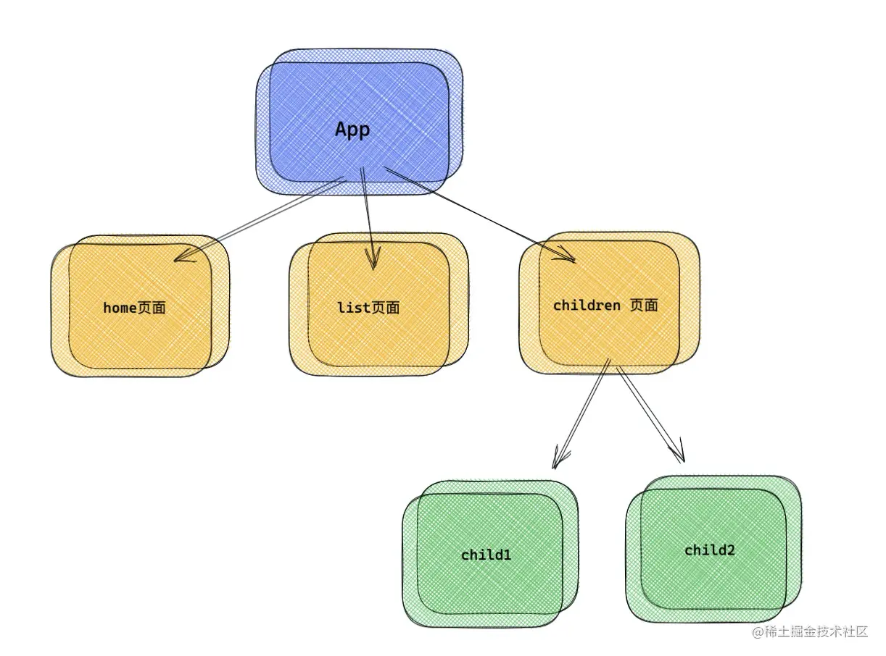

# 0. 参考资料

[印记中文](https://react-router.docschina.org/web/guides/philosophy)

React-router 已经更新到了v6，与v5发生了很大的变化，在熟悉一些基本的概念后，在以后的项目都需要使用v6，所以还需要了解发生了哪些改变，并且如何切换到v6.

[react-router v6 通关指南](https://juejin.cn/post/7069555976717729805)

[React-Router v6 新特性解读及迁移指南](https://blog.csdn.net/weixin_40906515/article/details/104957712)

# 1. 基本概念

## 1.1相关理解

### 1.1.1 SPA 理解

单页Web应用（single page web application，SPA）。

整个应用只有**一个完整的页面**。

点击页面中的链接**不会刷新**页面，只会做页面的**局部更新。**

数据都需要通过ajax请求获取, 并在前端异步展现。

### 1.1.2 路由理解

什么是路由？

1. 一个路由就是一个映射关系(key:value)
2. key为路径, value可能是function或component.

路由的分类：

- 后端路由：

  - 理解： value是function, 用来处理客户端提交的请求。

  - 注册路由： router.get(path, function(req, res))

  - 工作过程：当node接收到一个请求时, 根据请求路径找到匹配的路由, 调用路由中的函数来处理请求, 返回响应数据

- 前端路由：

  - 浏览器端路由，value是component，用于展示页面内容。

  - 注册路由: `<Route path="/test" component={Test}>`

  - 工作过程：当浏览器的path变为/test时, 当前路由组件就会变为Test组件

## 1.1 路由

React Router 中有三种类型的组件： router components, route matching components，和 navigation components。

你在 Web 应用程序中使用的所有组件都应该从 react-router-dom 中导入。

```jsx
import { BrowserRouter, Route, Link } from "react-router-dom";
```

每个 React Router 应用程序的核心应该是一个 router 组件。对于 Web 项目，`react-router-dom` 提供了 `<BrowserRouter>` 和 `<HashRouter>` 路由。这两个路由都会为你创建一个专门的 `history` 对象。一般来说，如果你有一个响应请求的服务器，则你应该使用 `<BrowserRouter>` ，如果你使用的是静态文件的服务器，则应该使用 `<HashRouter>` 。

```jsx
import { BrowserRouter } from "react-router-dom";
ReactDOM.render(
  <BrowserRouter>
    <App />
  </BrowserRouter>,
);
```

## 1.2 Route 匹配

有两个路由匹配组件： `<Route>` 和 `<Switch>` 。

路由匹配是通过比较 `<Route>` 的 `path` 属性和当前地址的 `pathname` 来实现的。当一个 `<Route>` 匹配成功时，它将渲染其内容，当它不匹配时就会渲染 `null`。没有路径的 `<Route>` 将始终被匹配。

你可以在任何你希望根据地址渲染内容的地方添加 `<Route>` 。列出多个可能的 `<Route>` 并排列出来往往很有意义。 `<Switch>` 用于将 `<Route>` 分组。

我们看一下大体的功能职责分配：

- **`BrowserRouter`** ：通过 history 库，传递 `history` 对象，`location` 对象。
- **`Switch`**：匹配唯一的路由 `Route`，展示正确的路由组件。
- **`Route`**： 视图承载容器，控制渲染 `UI` 组件。

在新版的 router 中，已经没有匹配唯一路由的 `Switch` 组件，取而代之的是 `Routes` 组件，但是我们不能把 Routes 作为 Switch 的代替品。因为在新的架构中 ，Routes 充当了很重要的角色，在 [react-router路由原理](https://juejin.cn/post/6886290490640039943) 文章中，曾介绍到 Switch 可以根据当前的路由 path ，匹配唯一的 Route 组件加以渲染。但是 Switch 本身是可以被丢弃不用的，但是在新版的路由中， Routes 充当了举足轻重的作用。比如在 v5 中可以不用 Switch 直接用 Route，但是在 v6 中使用 Route ，外层必须加上 Routes 组件，也就是 Routes -> Route 的组合。

### 标签 `<Switch>` 全部改为 `<Routes >`

与 `Switch` 相比，`Routes` 的主要优点是:

- `Routes` 内的所有 `<Route>` 和  `<Link>` 是相对的。这使得 `<Route path>` 和 `<Link to>` 中的代码更精简、更可预测
- 路由是根据最佳匹配而不是按顺序选择的
- 路由可以嵌套在一个地方，而不是分散在不同的组件中（当然也可以写在子组件中），而且嵌套的 parent route 的 `path` 不用加`*`

## 1.3 路由渲染属性

有三个属性来给 `<Route>` 渲染组件: `component` ，`render`，和 `children` 。



### `<Route>`

Route 组件也许是 React Router 中最重要的组件，它可以让你理解并学习如何使用它。它最基本的职责是在 location 与 Route 的 path 匹配时呈现一些 UI。

`component` 应该在你想渲染现存组件时使用 （ `React.Component` 或一个无状态组件）。`render`，只有在必须将范围内的变量传递给要渲染的组件时才能使用。你不应该使用具有内联函数的 `component` 属性来传递范围内的变量，因为你将要不必要的卸载/重载组件。

在**v6**版本中，它负责渲染React组件的UI。它有一个称为 `path` 的属性，该属性始终与应用程序的当前URL匹配。 第二个需要的属性叫做 `element`，当遇到当前的URL时，会告诉 `Route` 组件要渲染哪个React组件。这里的 `element` 键字也是新增加的，此前，在React Router v5中，你会使用名为 `component` 的属性。

`Route` 组件的 `element` 属性现在允许你传递一个React组件，而不仅仅是该React组件的名称。这样就可以很方便的把属性传到路由上：

```jsx
 <Route path="/" element={<Home />} />
```

