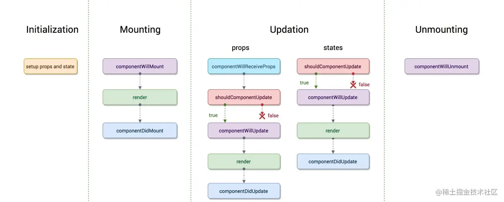
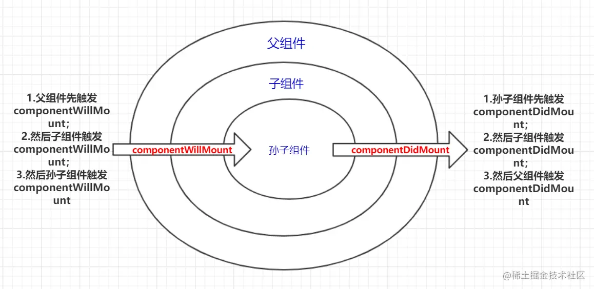
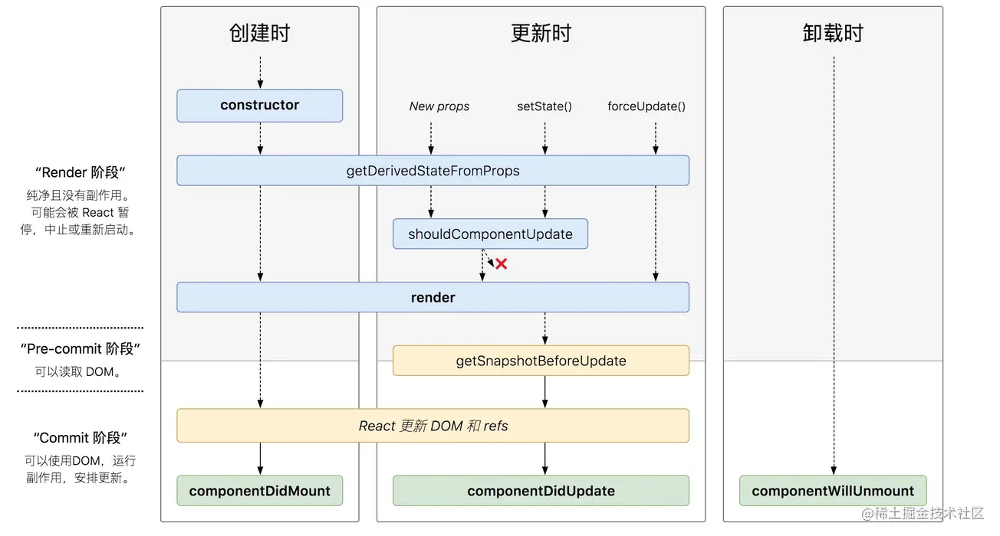

# React 生命周期

React 生命周期有新版和旧版，会分别介绍，并且对比新旧周期

参考资料：

[你真的了解 React 生命周期吗](https://juejin.cn/post/6844904021233238024)

[重学 React 之生命周期](https://juejin.cn/post/7044820041887383583)

## 1.旧的生命周期

 React 组件中的 `constructor` 和 `render` 也可以看作生命周期中的一部分。

.png)

- 初始阶段:首次渲染，由**ReactDOM.render()**依次触发以下钩子：
  - constructor
  - componentWillMount（组件即将挂载）
  - render
  - componentDidMount（组件完成挂载）
    - *一般在这个钩子中做一些初始化的事，例如：开启定时器、发送网络请求、订阅消息*

- 更新阶段:由内部组件`setState` 触发或者父组件 `render`：

  - shouldComponentUpdate（是否更新，返回布尔值，默认返回 true）

  - componentWillUpdate（组件即将更新）

  - render

  - componentDidUpdate（组件完成更新）

- 卸载组件：由 ReactDOM.unmountComponentAtNode()触发：
  - componentWillUnmount（组件即将卸载，一般在这里做一些收尾的事）
    - *一般在这个钩子中做一些收尾的事，例如：关闭定时器、取消订阅消息*



以上是 React 生命周期的主要三个阶段，其中更新阶段还有两个注意的点：

**第一个，如果组件是强制更新的，则不会触发 `shouldComponentUpdate` ，强制更新组件使用 `this.forceUpdate`() 方法；**

**第二个，如果是父组件触发子组件更新，子组件会先触发一个 `componentWillReceiveProps` 的生命周期。在这个生命周期里可以获取到旧的 `props`，可以使用 `this.setState()` 来更新状态，且不会重复触发 `render`**，名字叫为componentWill ReceiveNewProps可能会更贴切

### 触发模型



## 2. 新的生命周期



所谓新的生命周期，是在之前的基础上，移除了三个生命周期，即 `componentWillMount`，`componentWillUpdate` 和 `componentWillReceiveProps`。然后添加了两个新的生命周期，即`getDerivedStateFromProps` 和 `getSnapshotBeforeUpdate`。

**要移除的三个生命周期在目前版本（17.0.2）中还没有被移除，可以直接使用，也可以加前缀使用，即 `UNSAFE_componentWillMount`，`UNSAFE_componentWillUpdate` 和 `UNSAFE_componentWillReceiveProps`。**

### static getDerivedStateFromProps

```
static getDerivedStateFromProps(nextProps,prevState)`：接收父组件传递过来的 `props` 和组件之前的状态，返回一个对象来更新 `state` 或者返回 `null` 来表示接收到的 `props` 没有变化，不需要更新 `state
```

**该生命周期钩子的作用：** 将父组件传递过来的 `props` **映射** 到子组件的 `state` 上面，这样组件内部就不用再通过 `this.props.xxx` 获取属性值了，统一通过 `this.state.xxx` 获取。映射就相当于拷贝了一份父组件传过来的 `props` ，作为子组件自己的状态。注意：子组件通过 `setState` 更新自身状态时，不会改变父组件的 `props`

### getSnapshotBeforeUpdate

`getSnapshotBeforeUpdate(prevProps, prevState)`：**接收父组件传递过来的 `props` 和组件之前的状态，此生命周期钩子必须有返回值，返回值将作为第三个参数传递给** `componentDidUpdate`。必须和 `componentDidUpdate` 一起使用，否则会报错

**该生命周期钩子触发的时机** ：被调用于 `render` 之后、更新 `DOM` 和 `refs` 之前

**该生命周期钩子的作用：** 它能让你在组件更新 `DOM` 和 `refs` 之前，从 `DOM` 中捕获一些信息（例如滚动位置）