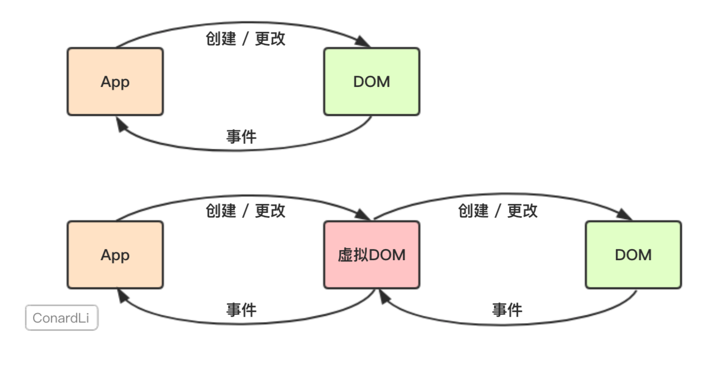

# 虚拟DOM

## 参考资料

[深入分析虚拟DOM的渲染原理和特性](https://juejin.cn/post/6844903824683958286)

## 简单介绍

在原生的`JavaScript`程序中，我们直接对`DOM`进行创建和更改，而`DOM`元素通过我们监听的事件和我们的应用程序进行通讯。

而`React`会先将你的代码转换成一个`JavaScript`对象，然后这个`JavaScript`对象再转换成真实`DOM`。这个`JavaScript`对象就是所谓的虚拟`DOM`。

## 为何使用虚拟DOM

`React`为何采用`VitrualDom`这种方案呢？

### 提高开发效率

使用`JavaScript`，我们在编写应用程序时的关注点在于如何更新`DOM`。

使用`React`，你只需要告诉`React`你想让视图处于什么状态，`React`则通过`VitrualDom`确保`DOM`与该状态相匹配。你不必自己去完成属性操作、事件处理、`DOM`更新，`React`会替你完成这一切。

这让我们更关注我们的业务逻辑而非`DOM`操作，这一点即可大大提升我们的开发效率。

### 关于提升性能

很多文章说`VitrualDom`可以提升性能，这一说法实际上是很片面的。

直接操作`DOM`是非常耗费性能的，这一点毋庸置疑。但是`React`使用`VitrualDom`也是无法避免操作`DOM`的。

如果是首次渲染，`VitrualDom`不具有任何优势，甚至它要进行更多的计算，消耗更多的内存。

`VitrualDom`的优势在于`React`的`Diff`算法和批处理策略，`React`在页面更新之前，提前计算好了如何进行更新和渲染`DOM`。实际上，这个计算过程我们在直接操作`DOM`时，也是可以自己判断和实现的，但是一定会耗费非常多的精力和时间，而且往往我们自己做的是不如`React`好的。所以，在这个过程中`React`帮助我们"提升了性能"。

所以，我更倾向于说，`VitrualDom`帮助我们提高了开发效率，在重复渲染时它帮助我们计算如何更高效的更新，而不是它比`DOM`操作更快。

### 跨浏览器兼容

`React`基于`VitrualDom`自己实现了一套自己的事件机制，自己模拟了事件冒泡和捕获的过程，采用了事件代理，批量更新等方法，抹平了各个浏览器的事件兼容性问题。

### 跨平台兼容

`VitrualDom`为`React`带来了跨平台渲染的能力。以`React Native`为例子。`React`根据`VitrualDom`画出相应平台的`ui`层，只不过不同平台画的姿势不同而已。

# Diff算法与Key机制

## 参考资料

[浅谈React 虚拟DOM，Diff算法与Key机制](https://juejin.cn/post/6967626390380216334#heading-1)

1. 虚拟DOM中key的作用：
                    1). 简单的说: key是虚拟DOM对象的标识, 在更新显示时key起着极其重要的作用。

                ​    2). 详细的说: 当状态中的数据发生变化时，react会根据【新数据】生成【新的虚拟DOM】, 
                ​                                随后React进行【新虚拟DOM】与【旧虚拟DOM】的diff比较，比较规则如下：

                ​                    a. 旧虚拟DOM中找到了与新虚拟DOM相同的key：
                ​                                (1).若虚拟DOM中内容没变, 直接使用之前的真实DOM
                ​                                (2).若虚拟DOM中内容变了, 则生成新的真实DOM，随后替换掉页面中之前的真实DOM

                ​                    b. 旧虚拟DOM中未找到与新虚拟DOM相同的key
                ​                                根据数据创建新的真实DOM，随后渲染到到页面   
                
            2. 用index作为key可能会引发的问题：
                                1. 若对数据进行：逆序添加、逆序删除等破坏顺序操作:
                                                会产生没有必要的真实DOM更新 ==> 界面效果没问题, 但效率低。
                                                    2. 如果结构中还包含输入类的DOM：
                                    会产生错误DOM更新 ==> 界面有问题。
                                                        3. 注意！如果不存在对数据的逆序添加、逆序删除等破坏顺序操作，
                                                    仅用于渲染列表用于展示，使用index作为key是没有问题的。
                            
            3. 开发中如何选择key?:
                                1.最好使用每条数据的唯一标识作为key, 比如id、手机号、身份证号、学号等唯一值。
                                2.如果确定只是简单的展示数据，用index也是可以的。