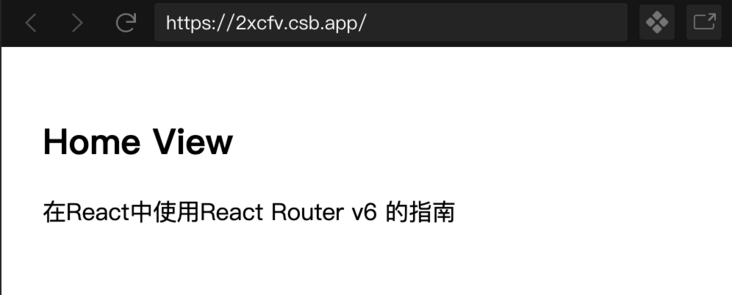
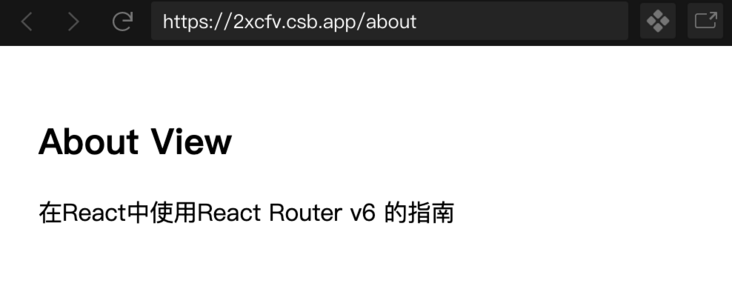
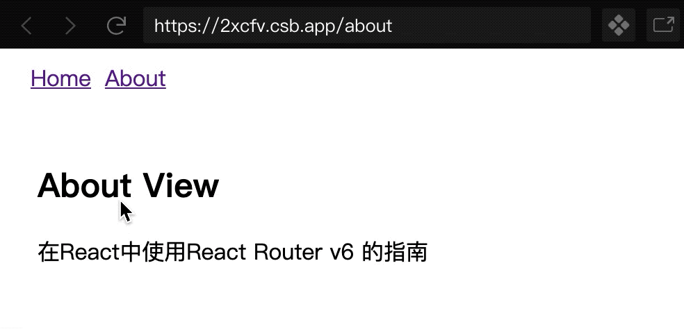
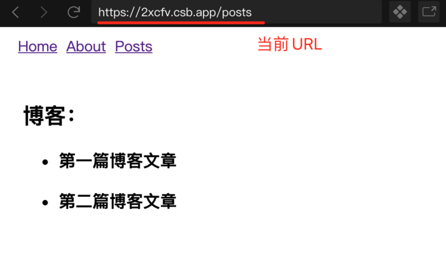
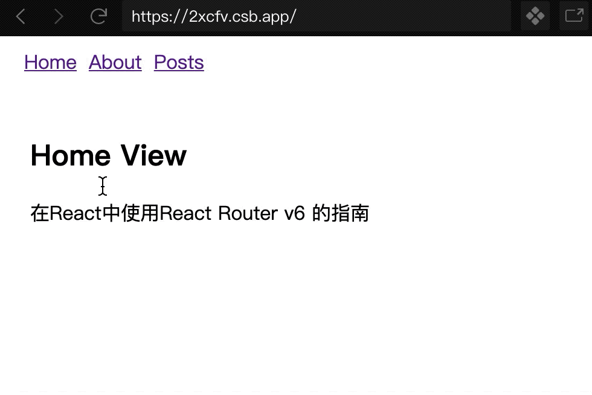

转载： https://segmentfault.com/a/1190000023684163

在本教程中，让我们看一下如何使用React Router v6库创建路由。请注意，在撰写本文时，React Router v6仍处于测试阶段。本教程将带你一窥该库即将推出的一些新功能。

如果你有在React应用程序中使用路由的经验，你可能已经知道在过去的几年里[Reach Router](https://link.segmentfault.com/?enc=2U0Evoa6F3%2FW01vnKlKg%2Bw%3D%3D.dvN5DKxSTGuO5k%2FRO%2FFfqjjY15JmWYRhhQxLXJscAO4%3D)已经引起了一定的关注，但是，它从版本6开始被合并回React Router库。这意味着v6版本比之前的版本有更小的包大小，这是Reach Router存在的主要原因之一。

## 先决条件

为了充分利用本教程，请确保你在本地开发环境中安装了以下内容。

- Node.js版本 >= 12.x.x
- 软件包管理器，例如npm或yarn或npx
- JavaScript，React.js和React Hooks的基础知识

## 入门

首先创建一个新的React应用。从终端窗口使用下面的命令生成项目目录，然后在项目目录内导航，安装所需的依赖项，添加React Router v6库。

```bash
npx create-react-app react-router-v6-example
cd react-router-v6-example
yarn add history react-router-dom@next
```

> 为了方便，我使用 codesandbox.io 作为演示，像这样的Demo代码推荐使用 codesandbox.io 这样在线的IDE工具

一旦安装了依赖关系，在你喜欢的代码编辑器中打开 `package.json` 文件，你会看到 `react-router-dom` 库的依赖版本。

```json
“dependencies": {
  // 安装的其余依赖项
  "react-router-dom": "6.0.0-beta.0",
},
```

## React Router库中的不同软件包

React Router库包含三个不同的npm包，以下每个包都有不同的用途。

- react-router
- react-router-dom
- react-router-native

程序包 `react-router` 是核心库，用作上面列出的他两个程序包的对等依赖项。`react-router-dom` 是React应用中用于路由的软件包。列表中的最后一个包，`react-router-native` 有用于开发React Native应用的绑定。

现在我们有了这些，让我们建立第一个路由。

## 使用React Router v6创建第一个路由

要使用React Router库创建第一个路由，打开 `src/App.js` 文件，添加以下导入语句。

```javascript
import { BrowserRouter as Router } from 'react-router-dom';
```

这是从 `react-router-dom` 库导入的第一个组件。它用于包装不同的路线，它使用HTML5 history API来跟踪React应用程序中的路由历史记录。

上面片段中的 `Router` 部分是别名，使编写起来更容易。建议在React应用的组件层次结构中的顶级组件上导入和使用它：

```javascript
function App() {
  return <Router>{/* 所有路由都嵌套在其中 */}</Router>;
}
```

从 `react-router-dom` 导入的下一个组件是新的 `Routes`：

```javascript
import { BrowserRouter as Router, Routes } from 'react-router-dom';
```

这个新的元素是以前 `Switch` 组件的升级版，它包括相对路由和链接、自动路由排名、嵌套路由和布局等功能。

所需的 `react-router-dom` 中的最后一个组件称为 `Route`，它负责渲染React组件的UI。它有一个称为 `path` 的属性，该属性始终与应用程序的当前URL匹配。 第二个需要的属性叫做 `element`，当遇到当前的URL时，会告诉 `Route` 组件要渲染哪个React组件。这里的 `element` 键字也是新增加的，此前，在React Router v5中，你会使用名为 `component` 的属性。

为了在下面的演示中创建第一个路由，让我们创建一个名为 `Home` 的基本函数组件，返回一些JSX。

```javascript
function Home() {
  return (
    <div style={{ padding: 20 }}>
      <h2>Home View</h2>
      <p>在React中使用React Router v6 的指南</p>
    </div>
  );
}
```

使用以下路由更新 `App` 函数组件。这里需要注意的v6库的另一个特点是，`Route` 组件的 `element` 属性现在允许你传递一个React组件，而不仅仅是该React组件的名称。这样就可以很方便的把属性传到路由上：

```javascript
function App() {
  return (
    <Router>
      <Routes>
        <Route path="/" element={<Home />} />
      </Routes>
    </Router>
  );
}
```

要查看它是否正常工作，请返回到终端窗口，并使用命令 `yarn start` 启动开发服务器。接下来，在浏览器窗口中访问URL [http://localhost](https://link.segmentfault.com/?enc=LX4HhB1VM1H7VfDCgJ%2BcFw%3D%3D.QX30k5vfokaYVmZ4F2vl%2B%2FIiCVoZDUFxSaB8T3LzcZA%3D):3000。

这是此步骤之后的输出：



让我们快速创建另一个名为 `About` 的函数组件，只有当浏览器窗口中的URL为[http://localhost](https://link.segmentfault.com/?enc=OSbFAfMSWkv3G3Pf6HjkOg%3D%3D.WD1rdP77wnYsqWO2QB2q9z%2B3DiIT3CAkRYPIhC%2FRlow%3D):3000/about时才会呈现。

```javascript
function About() {
  return (
    <div style={{ padding: 20 }}>
      <h2>About View</h2>
      <p>在React中使用React Router v6 的指南</p>
    </div>
  );
}
```

然后，为 `About` 组件添加 `Route`：

```xml
<Routes>
  <Route path="/" element={<Home />} />
  <Route path="/about" element={<About />} />
</Routes>
```

现在，返回浏览器窗口并访问URL [http://localhost](https://link.segmentfault.com/?enc=xWTxxLIwOrXHOzCI2p0OEg%3D%3D.5Dv2iU7Mmg92pLdIJS6VR4CjRGbdyzNb0Ck%2BXwegq04%3D):3000/about：



## 添加导航菜单

为了在React应用程序内的特定路由或演示应用程序中现有的两个路由上导航，让我们在 `react-router-dom` 的 `Link` 组件的帮助下添加一个最小的导航栏。

首先从库中导入它：

```javascript
import { BrowserRouter as Router, Routes, Route, Link } from 'react-router-dom';
```

在HTML中的不同网页之间导航的概念是使用锚点标记：

```xml
<a href="">Some Link Name</a>
```

在React应用程序中使用这种方法将导致在每次渲染新视图或页面本身时刷新web页面。为了避免刷新网页，`react-router-dom` 库提供了 `Link` 组件。

接下来，在 `App` 函数组件内部，创建一个导航栏，如代码片段所示：

```xml
<Router>
  <nav style={{ margin: 10 }}>
    <Link to="/" style={{ padding: 5 }}>
      Home
    </Link>
    <Link to="/about" style={{ padding: 5 }}>
      About
    </Link>
  </nav>
  {/* 其余代码保持不变 */}
</Router>
```

到浏览器窗口，以查看正在运行的导航栏：



## 如何处理嵌套路由

嵌套路由是一个很重要的概念，需要理解。当路由被嵌套时，一般认为网页的某一部分保持不变，只有网页的子部分发生变化。

例如，如果你访问一个简单的博客，则始终显示该博客的标题，然后在其下方显示一个博客文章列表。但是，当你单击博客文章时，博客文章列表将替换为该特定博客文章的内容或描述。这是本节将要执行的示例，以了解如何在最新版本的React Router库中处理嵌套路由。

在React Router v5中，必须明确定义嵌套路由，React Router v6并非如此。它从React Router库中挑选了一个名为 `Outlet` 的最佳元素，为特定路由呈现任何匹配的子元素。首先，从 `react-router-dom` 库中导入 `Outlet`：

```javascript
import { Outlet } from 'react-router-dom';
```

为了模仿基本博客，我们在 `App.js` 文件中添加一些模拟数据。该代码段包含一个称为 `BlogPosts` 的对象，该对象进一步包含不同的对象作为属性。每个对象都由三部分组成：

- 一个唯一的ID
- 文章的标题
- 文章的描述

```javascript
const BlogPosts = {
  '1': {
    title: 'First Blog Post',
    description: 'Lorem ipsum dolor sit amet, consectetur adip.'
  },
  '2': {
    title: 'Second Blog Post',
    description: 'Hello React Router v6'
  }
};
```

这个独特的片段将被用于web浏览器的URL中，以查看每个帖子的内容。接下来，创建一个名为 `Posts` 的函数组件，其中显示所有博客帖子的列表：

```javascript
function Posts() {
  return (
    <div style={{ padding: 20 }}>
      <h2>Blog</h2>
      {/* 渲染任何匹配的子级 */}
      <Outlet />
    </div>
  );
}
```

定义另一个名为 `PostLists` 的组件，只要浏览器窗口中的URL点击[http://localhost](https://link.segmentfault.com/?enc=9Af3rx%2Fl7sbckLfspTcAmQ%3D%3D.4vTVWm17NvLIaxKCV1Y8EvvlhsPkQvZKtv0RDI3tnhw%3D):3000/posts，就会显示所有文章的列表。让我们使用JavaScript `Object.entry()` 方法从对象 `BlogPosts` 中返回一个数组，这个数组将被映射为显示所有博客文章的标题列表：

```javascript
function PostLists() {
  return (
    <ul>
      {Object.entries(BlogPosts).map(([slug, { title }]) => (
        <li key={slug}>
          <h3>{title}</h3>
        </li>
      ))}
    </ul>
  );
}
```

修改 `App` 函数组件中的路由，如下所示：

```xml
<Routes>
  {/* 其余代码保持不变 */}
  <Route path="posts" element={<Posts />}>
    <Route path="/" element={<PostLists />} />
  </Route>
</Routes>
```

这表明每当触发URL [http://localhost](https://link.segmentfault.com/?enc=hN4xTVabf0K%2FxcGev2IXpQ%3D%3D.TfKgvI6pZlziX%2B0wAbHGHUiar99JwveMmnQcYAlan3Q%3D):3000/posts时，将渲染博客文章列表，因此，组件 `PostsLists`：



## 如何访问路由的URL参数和动态参数

要想从渲染的博客文章列表中点击文章标题来访问各个文章，你要做的就是，将每个文章的标题包裹在 `PostsLists` 组件中的 `Link` 组件内。然后，使用每个文章的 `slug` 定义每个文章的路径，前缀为 `/posts/` 的文章在浏览器中的路径是一致的。

```xml
<ul>
  {Object.entries(BlogPosts).map(([slug, { title }]) => (
    <li key={slug}>
      <Link to={`/posts/${slug}`}>
        <h3>{title}</h3>
      </Link>
    </li>
  ))}
</ul>
```

接下来，从 `react-router-dom` 库中导入一个名为 `useParams` 的钩子。通过这个钩子，你可以访问特定路由（或Slug）可能具有的任何动态参数。每个 `slug` 的动态参数都会是每篇博文的 `title` 和 `description`。访问它们的需要是，当在浏览器窗口中以URL形式触发博客文章的特定段时，显示每个博客文章的内容：

```javascript
import { useParams } from 'react-router-dom';
```

创建一个名为 `Post` 的新函数组件，该组件将从 `useParams` 钩子中获取当前的文章。使用JavaScript中的方括号符号语法，将创建一个新的 `post` 变量，该变量包含属性的值或博客文章的当前内容。

```javascript
function Post() {
  const BlogPosts = {
    "1": {
      title: "第一篇博客文章",
      description: "第一篇博客文章，是关于Vue3.0的"
    },
    "2": {
      title: "第二篇博客文章",
      description: "Hello React Router v6"
    }
  };
  
  const { slug } = useParams();
  const post = BlogPosts[slug];
  const { title, description } = post;
  return (
    <div style={{ padding: 20 }}>
      <h3>{title}</h3>
      <p>{description}</p>
    </div>
  );
}
```

最后，在 `App` 函数组件中添加一个称为 `:slug` 的动态路由，以渲染每个文章的内容：

```xml
// 其余代码保持不变
<Route path="posts" element={<Posts />}>
  <Route path="/" element={<PostLists />} />
  <Route path=":slug" element={<Post />} />
</Route>
```

这是此步骤之后的完整输出：



